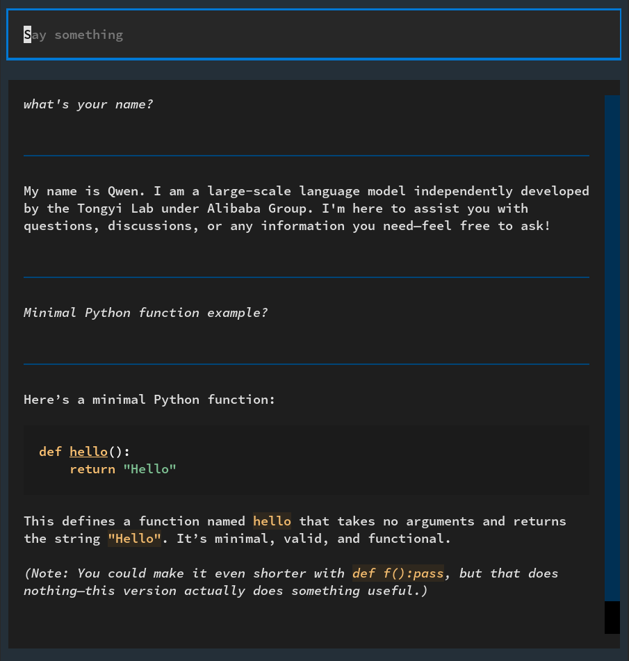

# AI-Chat-TUI

Experimental AI chat TUI to be used with `llama-server` (for now)





## Install and use

```
git clone https://github.com/frans-fuerst/ai-chat-tui.git
cd ai-chat-tui
uv sync
uv run chat
```

To let the bot talk to itself run
```
uv run discussion
```

.. and to record a discussion you could run
```
uv run discussion | tee "chat-$(date +'%y%m%d-%H%M%S').md" 
```


## License

See [License.md](License.md).


## Contribution

```bash
git clone https://github.com/frans-fuerst/ai-chat-tui.git
cd ai-chat-tui
uv run pre-commit install
```
.. make your changes and check if they pass the configured gate keepers.

```bash
# run all checks which would be executed on commit, but on unstaged stuff, too
uv run pre-commit run --hook-stage pre-commit --all-files
```


## Wishlist

- [x] Enter 'prompt'
- [x] Continuation
- [x] Set initial prompt / chat template
- [ ] Up/Down: User input history
- [ ] CTRL-D (clear)
- [ ] CTRL-C (abort)
- [ ] Multiline input
- [ ] Spoiler for parameters (URL, chat parameters, etc.)


## External Sources

* [LLaMAfiler Chat Completions Endpoint](https://github.com/mozilla-ai/llamafile/blob/main/llamafile/server/doc/v1_chat_completions.md)


* https://github.com/ggml-org/llama.cpp/discussions/8947
* https://github.com/abetlen/llama-cpp-python